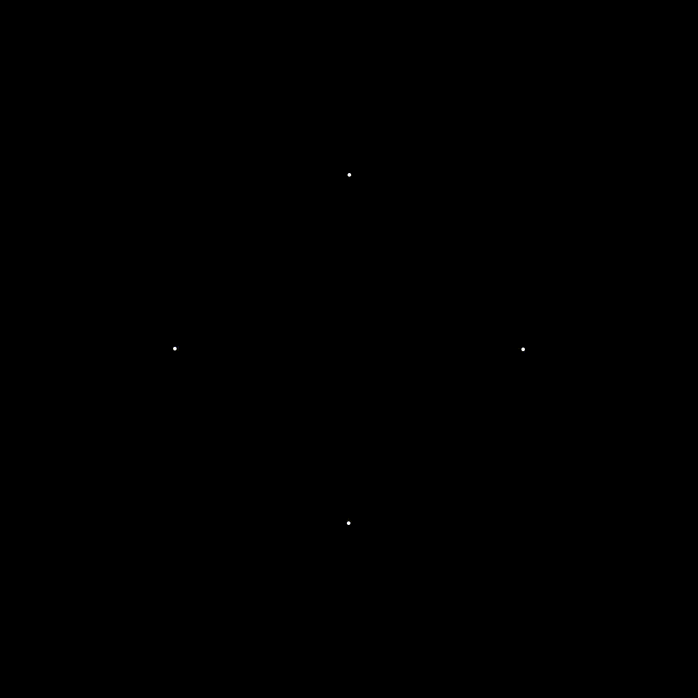
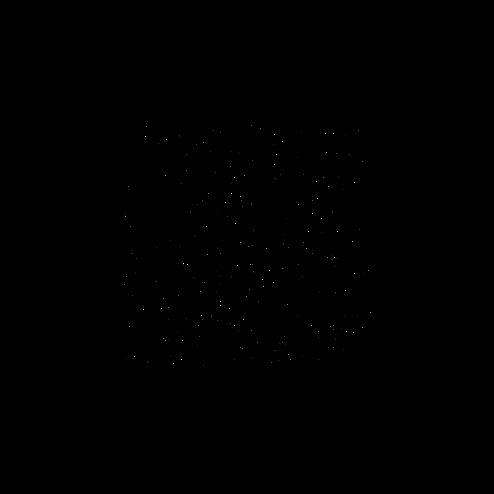

# Gravity Simulator

This is a python program that simulates gravity between many particles. It outputs a folder of images which can be combined into a video.

## Requirements

This simulation uses Pillow (a variant of PIL) to create the images of the simulation.

## Specifying the Particles

The particles are created using the class  `Particle` and have 3 parameters:

* Mass - a float greater than 0
* Position - an array with two floats
* Velocity - an array with two floats

There are two ways of specifying the initial mass, position and velocity of the particles in the simulation:

### Defined Particles

Using ` DefinedParticles.py ` you can decide exactly the mass, position and velocity of the particles you want to simulate. This works well when you have a small number of particles or the particles are nicely arranged.

``` python
particles = [
    Particle( mass, [x_pos, y_pos], [x_vel, y_vel]),
    # Repeat for all of the particles
]
```

For example, the following 4 particle simulation was created by defining the particles:


 
 ### Random Particles

 Using ` RandomParticles.py`  you can decide on the number of particles in the simulation, which are then given random masses, positions and velocities.

 ```python
particles = [
    Particle(
        random.randint(min_mass, max_mass),
        [random.randint(min_x_pos,max_x_pos),random.randint(min_y_pos,max_y_pos)],
        [random.randint(min_x_vel,max_x_vel),random.randint(min_y_vel,max_y_vel)]) 
    for i in range(NumberOfParticles)]
 ```

There are many inputs that need to be defined:

* `min_mass`: The smallest possible mass of the particles
* `max_mass`: The largest possible mass of the particles
- `min_x_pos`: The smallest x position
- `max_x_pos`: The largest x position
* `min_y_pos`: The smallest y position
* `max_y_pos`: The largest y position
- `min_x_pos`: The smallest x velocity
- `max_x_pos`: The largest x velocity
* `min_y_pos`: The smallest y velocity
* `max_y_pos`: The largest y velocity
- `NumberOfParticles`: The number of particles you want to simulate

For example, the following 300 particle simulation was created using this definition:

```python
particles = [
    Particle(
        1,
        [random.randint(250,750),random.randint(250,750)],
        [0,0]) 
    for i in range(300)]
```



